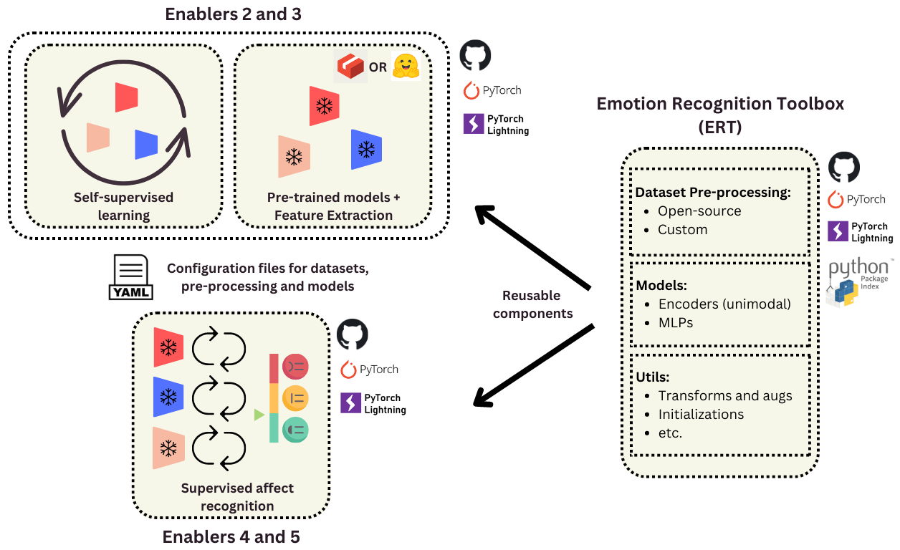

# Overview

This page is used to store the internal documentation for the XR2Learn Emotion Recognition (ER) Enablers. The internal documentation provides useful materials and guidelines to simplify the process of developing, maintaining and testing the Enablers by the project consortium developers.

## Architecture
The architecture of the Emotion Recognition Enablers consists of four main components:

- **Emotion Recognition Toolbox (ERT):** Python library providing the main building blocks to enable Emotion Recognition, including Deep Learning model templates and classes, pre-processing routines for open-source and custom (to be added) datasets, and supporting utils.

- **Enablers 2/3:** provide tools for pre-training Deep Learning ER models and building representation of emotions (Enabler 2), a registry of models pre-trained on open-source datasets (Enabler 3), and tools for using these models in order to generate representations (feature extraction module for Enabler 3).

- **Enablers 4/5:** Enabler 4 supports training supervised models or fine-tuning them using models pre-trained within Enabler 2/3. Enabler 5 provide tools for implementing and evaluatinng multimodal fusion schemas.

- **Enabler 6:** inference tool. TBC.

### Enablers 2-5

The overall schema showing the workflow of the Enablers 2-5 and its communication with ERT is shown below. ERT provides the components, such as data pre-processing classes, models and utils, re-usable is all the enablers.
<figure markdown>
  { width="900" }
  <figcaption>ERT and Enablers 2-5</figcaption>
</figure>

### Enabler 6

TBC

## Useful links

- Emotion Recognition Toolbox (ERT): [https://github.com/um-xr2learn-enablers/emorec-toolbox](https://github.com/um-xr2learn-enablers/emorec-toolbox)
- Enablers 2/3: [https://github.com/um-xr2learn-enablers/enablers23](https://github.com/um-xr2learn-enablers/enablers23) 
- Enablers 4/5: [https://github.com/um-xr2learn-enablers/enablers45](https://github.com/um-xr2learn-enablers/enablers45)
- Enabler 6: TBD